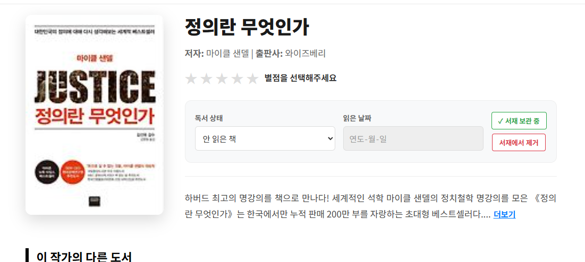
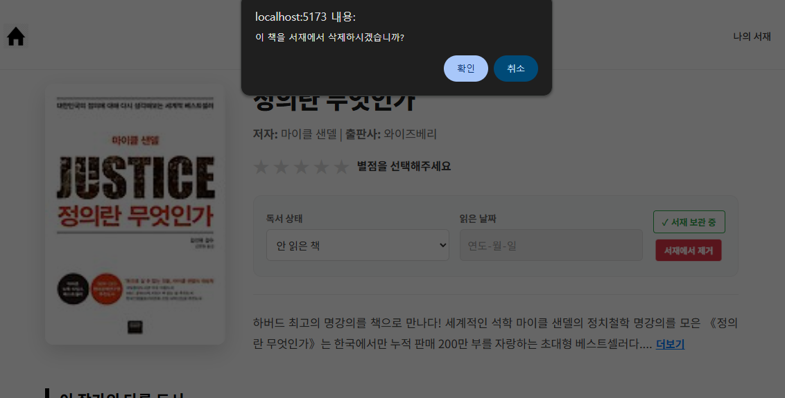
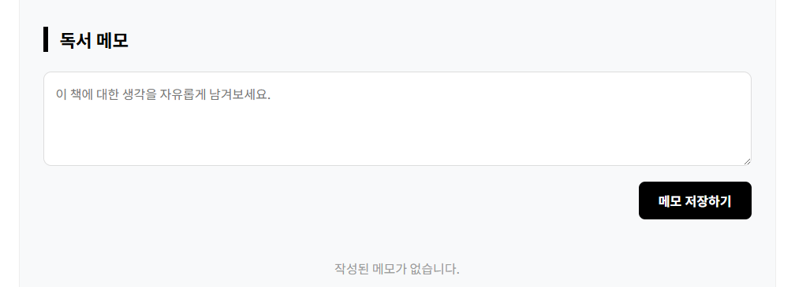
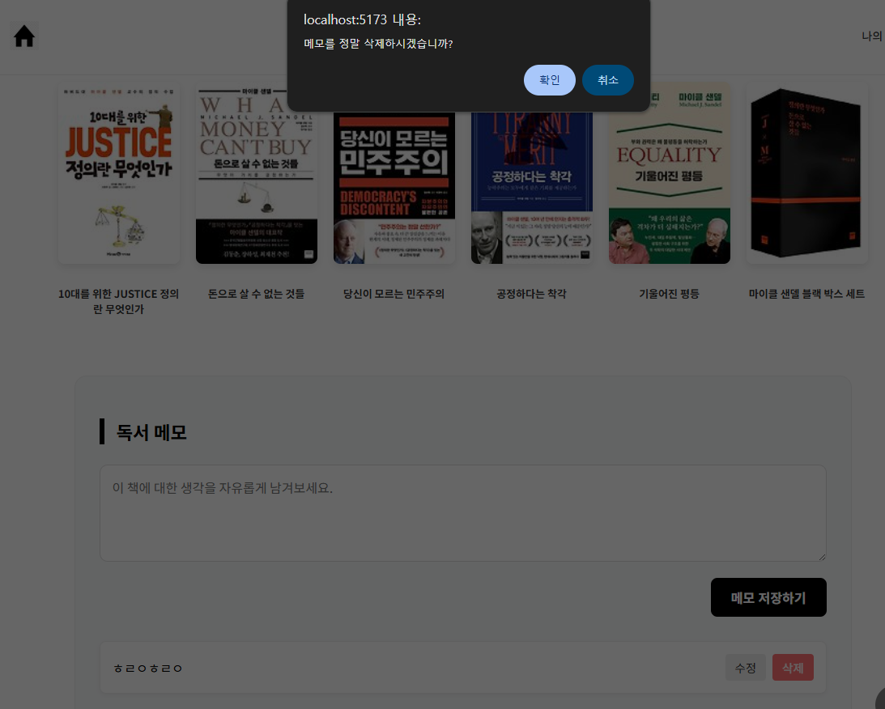
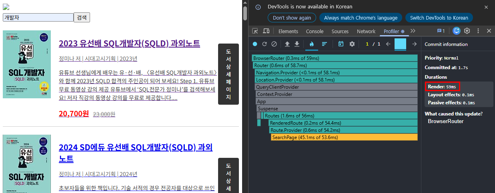
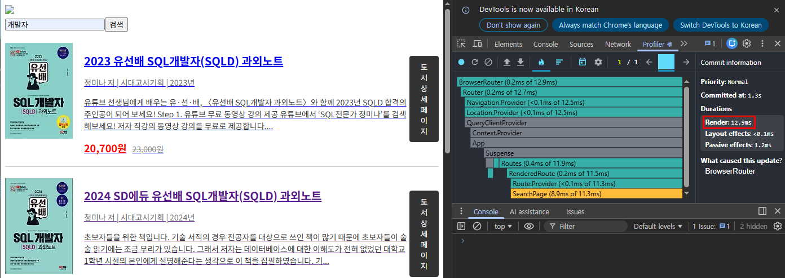
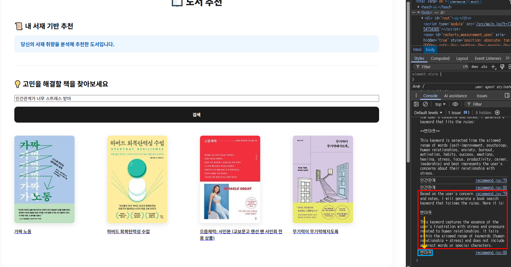
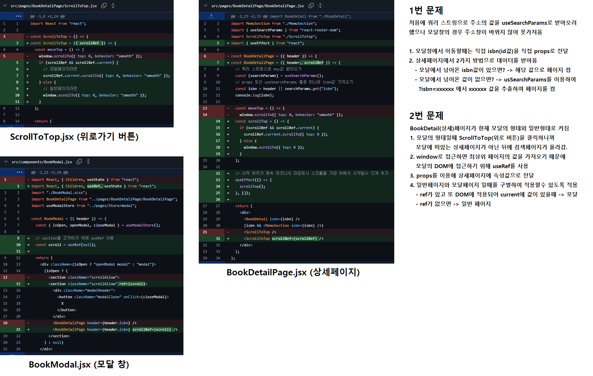

# 독서 기록•메모 기반 도서 추천 웹앱

## 프로젝트 소개

저희 프로젝트는 단순한 추천이 아니라  
**사용자의 맥락(Context)을 이해하는 추천 시스템**을 목표로 합니다.

사용자의 고민 + 과거 메모 데이터를 함께 분석하여  
LLM이 핵심 주제를 추출하고,  
이를 실제 도서 검색 API와 연결하여 결과를 제공합니다.

기존의 독서 기록 애플리케이션들은 기록, 통계화에 중점을 두어  
북 큐레이션의 분야에는 약한 모습을 보였습니다  
이에 저희는 다음과 같은 기능을 갖춘 웹앱을 기획했습니다.

- 개인화된 서재
- 개인 노트/메모 기반 분석
- 컨텍스트 기반 추천 시스템


## 팀원 & 역할 분담

| 이름 | GitHub | 역할 |
|---|---|:--|
| 황용현 <br> (팀장) | [@sai0734](https://github.com/sai0734) | 전역 Store 데이터관리 (Zustand) <br/> 외부 API 연동 ( Kakao Book Search API) <br/> CRUD 구성 <br/> 커스텀훅 설정 |
| 양정훈 | [@yangjeonghun-997](https://github.com/yangjeonghun-997) | SPA 구성 (Router, lazy, Suspense) <br/> 외부 API 연동 ( Kakao Book Search API) <br/> 무한 스크롤 |
| 김지희 | [@JeeheeK1013](https://github.com/JeeheeK1013) | 역할 |

[팀 노션](https://www.notion.so/Team_01-348530c3f88b804cad05d8ad4806b925)

## 기술 스택

- Frontend: React, Sass
- 외부 API: Kakao Book Search API
- AI: Ollama model Llama3
- 기타: SPA, 무한 스크롤, 반응형 웹

## 사용 라이브러리 및 버전

```json
{
    "@tanstack/react-query": "^5.100.1",
    "axios": "^1.15.2",
    "classnames": "^2.5.1",
    "react": "^19.2.4",
    "react-calendar": "^6.0.1",
    "react-dom": "^19.2.4",
    "react-is": "^19.2.5",
    "react-router-dom": "^7.14.1",
    "recharts": "^3.8.1",
    "sass": "^1.99.0",
    "styled-components": "^6.4.0",
    "zustand": "^5.0.12"
  }
```

## 설치 및 실행

### Frontend

```bash
npm i
npm run dev
```

### Ollama AI

```bash
brew install ollama
ollama pull llama3
ollama run llama3
```

## 주요 구현 기능

### CRUD 기능

> 사용자가 직접 책을 서재에 등록, 삭제할 수 있고  
> 책에 대해 자유롭게 노트를 등록, 수정, 삭제 할 수 있도록 구현했습니다.

- 서재에 책 등록, 삭제 (책 상태, 읽은 날짜, 별점 입력 가능)
- 각 책에 대한 노트 작성
- 서재에서 조회 가능
- 노트 수정 및 즉시 반영
- 서재에서 책 제거 및 노트 삭제 기능

| 등록(Create) / 조회(Read) / 수정(Update) | 삭제(Delete) |
| --- | --- |
|  |  |
|  |  |

### SPA (Single Page Application)

> React Router를 사용하여 새로고침 없이 컴포넌트 단위로 화면이 갱신되어  
> 부드러운 페이지 전환을 구현했습니다.

- 로그인 및 회원가입(Login) - 사용자 등록 및 로그인
- 서재•노트 기반 추천(Home) - 사용자 기록•입력에 기반한 도서 추천
- 내 서재(MyPage) - 사용자 통계 및 독서 캘린더, 서재 기능
- 서재에 책 추가(SearchPage) - 책 검색 및 서재에 등록

#### 라우팅 구조 (Routing Structure)

| Path | Page <br/> (Component) | 설명 |
| :-- | :-- | :-- |
|```/```| Login | 로그인 화면 |
|```/home```| Home | 메인 화면 - 사용자 기록 기반 추천 도서 표시 |
|```/searchpage```| SearchPage | 도서 검색 기능 제공 |
|```/book?isbn=:query```| BookDetailPage | 선택한 도서 상세 정보 조회 및 노트 기능 |
|```/mypage```| MyPage | 통계 서비스 및 서재 페이지 |

### 코드 스플리팅

> ```lazy``` 와  ```Suspense``` 를 활용하여 페이지별 코드 분할을 적용했습니다.

- 페이지 단위 로드

### 무한 스크롤

> ```react-query``` 라이브러리를 사용하여 대량 데이터의 렌더링 성능을 최적화했습니다.

- 스크롤에 따라 필요한 컴포넌트 렌더링

Before

After

적용 화면


### zustand 상태 관리

> ```zustand``` 라이브러리를 사용하여 전역 데이터를 관리합니다.

### 외부 API 연동

> 카카오 책 검색 API에 기반하여 도서 정보를 제공합니다.

- Kakao Book Search API: 책 검색

### Ollama AI

> Ollama의 Llama3 모델을 사용하여
> 로컬에서 LLM 서버를 돌립니다.

Ollama는 사용자의 서재 내 책 목록, 기록한 노트, 현재의 고민을 전달받아  
분석 후 책을 추천하는데 가장 적합한 키워드를 산출합니다.  

이렇게 산출된 결과가 원하던 형식과 다를수 있으므로  
별도의 후처리 과정을 거쳐 원하는 형식의 결과로 만들어줍니다.

```javaScript
const extractKoreanWord = (text) => {
    const match = text.match(/[가-힣]+/g);
    return match ? match[0] : null;
  };
```

## 대표 문제사항
Modal창을 사용하여 생긴 문제점 2가지
1. 상세페이지에서 책의 isbn(코드)값을 쿼리스트링으로 받아오려 했으나 Modal창은 주소가 변하지 않음 <br>
 -> Modal창일 경우 props를 이용하여 자식에 속한 상세페이지에게 전달. <br>
 -> 일반창일 경우 useSearchParams()를 사용하여 쿼리스트링으로 책의 isbn(코드)값을 전달 <br>


## Flow & UI

## 마무리

이 프로젝트는 단순히 개인화된 서재를 제공하는 것을 넘어  
사용자의 고민을 기반으로 "사용자의 상황을 이해하고 추천하는 서비스"를 제공합니다.

7일간의 개발 기간 동안 팀원들과 협력하여 **React 기반 SPA, 외부 API 연동  
AI 추천 시스템, 무한 스크롤, 코드 스플리팅** 등 다양한 기술을 설계•구현했습니다.

이 과정에서 서비스 설계에 있어 중요한 것은 기능 단위가 아닌 **서비스 전체 흐름 기준의 설계**  
즉 특정 기술보다 **"사용자가 어떤 흐름으로 서비스를 경험하는가"** 가 중요하다는 것을  알게되었습니다.
